# TSB Contract — Full Flow Diagrams

---

## 1. Architecture — Contract Relationships

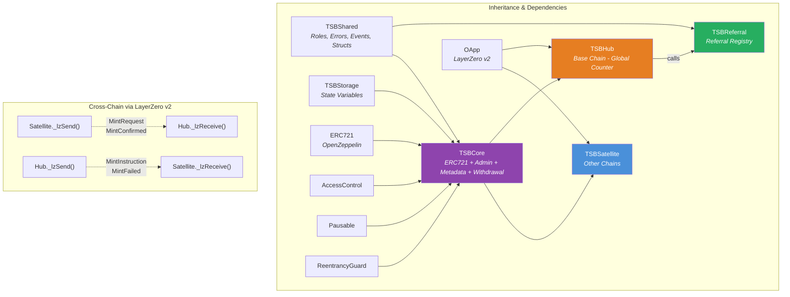

---

## 2. Flow A: Cross-Chain Mint — Happy Path (Satellite → Hub → Satellite → Hub)

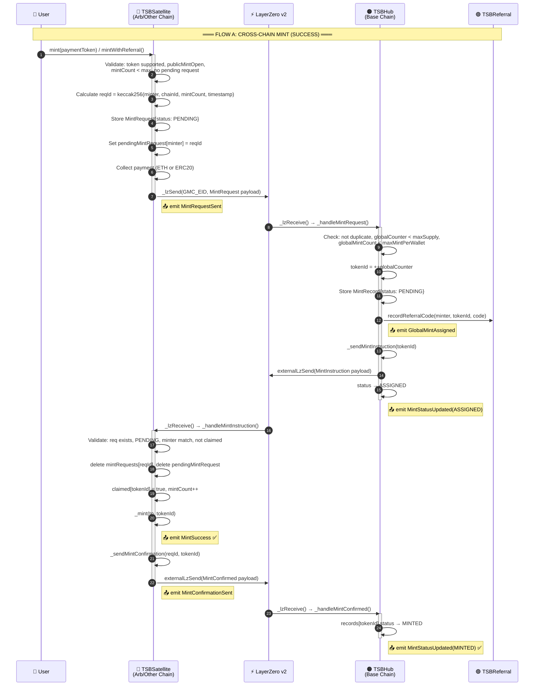

---

## 3. Flow B: Local Mint on Hub Chain (No Cross-Chain)

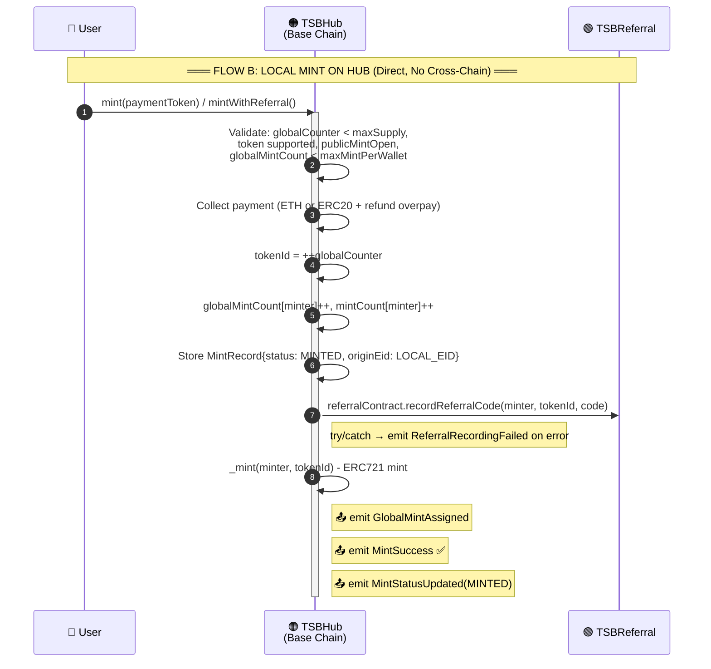

---

## 4. Failure 1: Satellite → Hub Message Delivery Fails

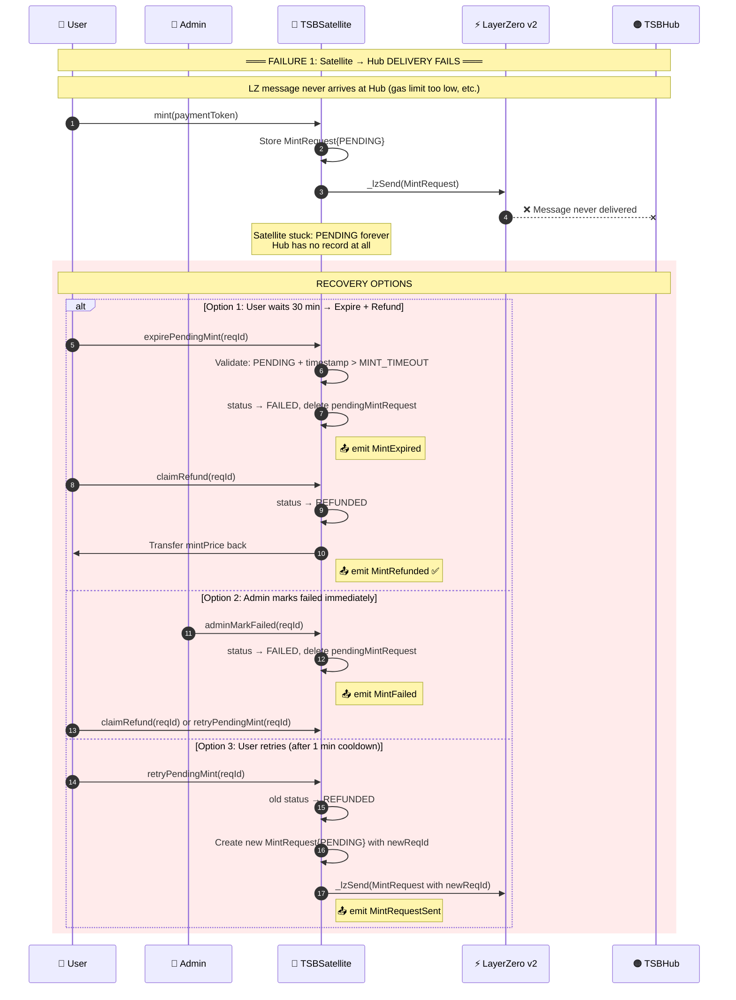

---

## 5. Failure 2: Hub → Satellite Reply Fails (TokenId Already Allocated)

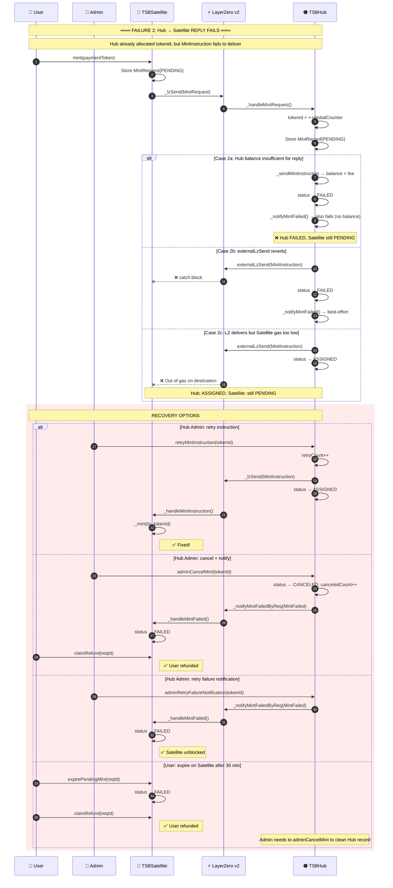

---

## 6. Failure 3: Hub Validation Rejects + MintFailed Notification Fails

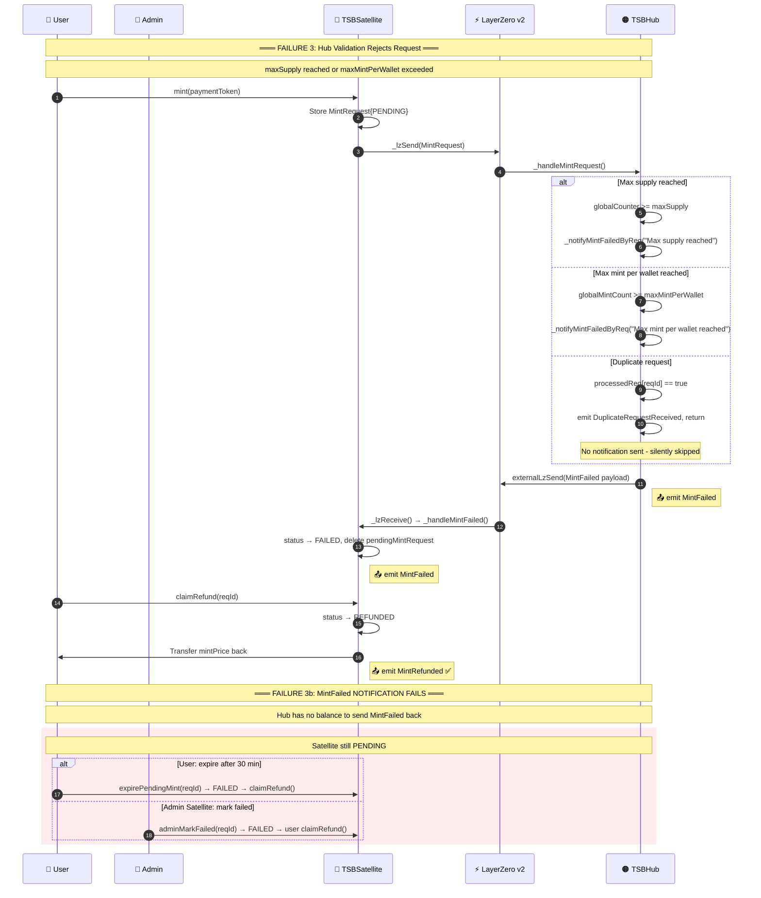

---

## 7. Failure 4: MintConfirmed Delivery Fails (Hub Stuck at ASSIGNED)

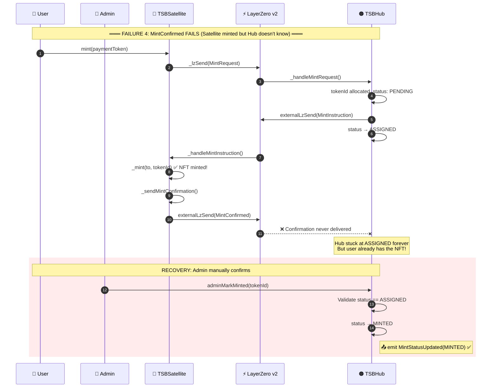

---

## 8. Failure 5: Race Condition — User Expires During In-Flight Instruction

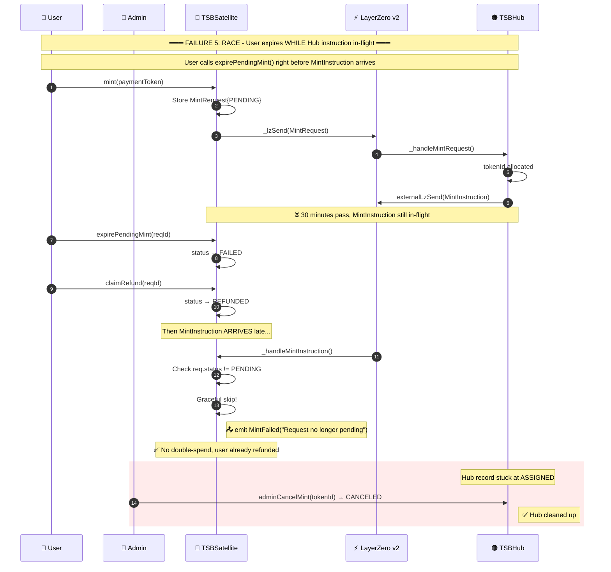

---

## 9. Flow: retryPendingMint — User Self-Recovery

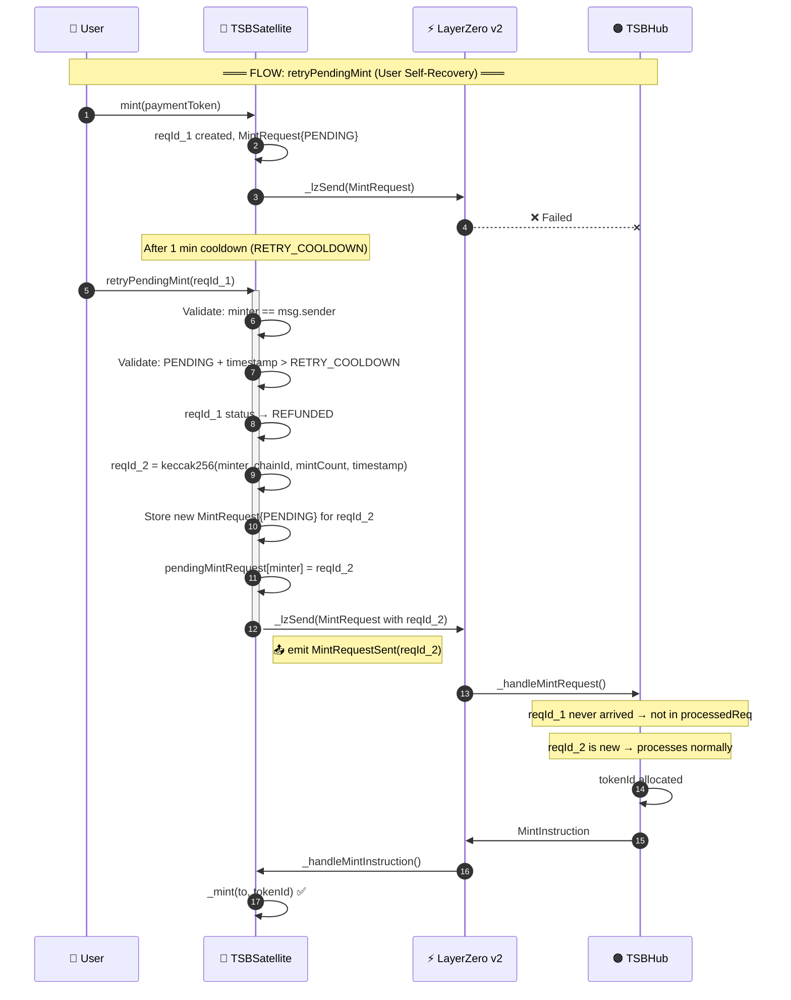

---

## 10. State Transitions: Satellite MintStatus vs Hub Status

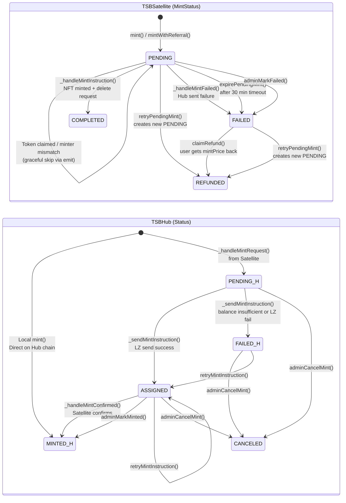

---

## 11. Complete Function Map: All Contracts

```mermaid
graph TB
    subgraph "TSBSatellite - All Functions"
        direction TB

        subgraph "User Functions"
            SM["mint(paymentToken)<br/>→ returns bytes32 reqId"]
            SMR["mintWithReferral(paymentToken, code)<br/>→ returns bytes32 reqId"]
            RETRY["retryPendingMint(reqId)<br/>→ old REFUNDED, new PENDING"]
            REFUND["claimRefund(reqId)<br/>→ FAILED → REFUNDED + transfer"]
            EXPIRE["expirePendingMint(reqId)<br/>→ PENDING → FAILED after 30 min"]
        end

        subgraph "Internal / LZ"
            MC["_mintCore(token, code)<br/>→ validates, pays, stores, sends LZ"]
            LZR["_lzReceive()<br/>→ routes MintInstruction / MintFailed"]
            HMI["_handleMintInstruction()<br/>→ validates, _mint(), confirm"]
            HMF["_handleMintFailed()<br/>→ status FAILED"]
            CONF["_sendMintConfirmation()<br/>→ best-effort MintConfirmed to Hub"]
            EXT["externalLzSend()<br/>→ try/catch wrapper for _lzSend"]
        end

        subgraph "Admin Functions"
            AMF["adminMarkFailed(reqId)<br/>→ PENDING → FAILED"]
        end

        subgraph "View Functions"
            QUOTE["quoteLayerZeroFee(minter, code)<br/>→ nativeFee"]
        end

        SM --> MC
        SMR --> MC
        LZR --> HMI
        LZR --> HMF
        HMI --> CONF
        CONF --> EXT
    end

    subgraph "TSBHub - All Functions"
        direction TB

        subgraph "User Functions (Local)"
            HM["mint(paymentToken)"]
            HMR["mintWithReferral(paymentToken, code)"]
        end

        subgraph "Internal / LZ"
            HMC["_mintCore(token, code)<br/>→ direct ERC721 mint, status MINTED"]
            HLZR["_lzReceive()<br/>→ routes MintRequest / MintConfirmed"]
            HHMR["_handleMintRequest(eid, payload)<br/>→ allocate tokenId, send instruction"]
            HHMC["_handleMintConfirmed(payload)<br/>→ ASSIGNED → MINTED"]
            HSMI["_sendMintInstruction(tokenId)<br/>→ send MintInstruction to Satellite"]
            HNMF["_notifyMintFailed(tokenId, reason)<br/>→ send MintFailed"]
            HNMFR["_notifyMintFailedByReq(reqId, eid, minter, reason)<br/>→ send MintFailed before tokenId"]
            HEXT["externalLzSend()<br/>→ try/catch wrapper"]
        end

        subgraph "Admin Functions"
            HRMI["retryMintInstruction(tokenId)<br/>→ resend MintInstruction"]
            HACM["adminCancelMint(tokenId)<br/>→ CANCELED + notify Satellite"]
            HARFN["adminRetryFailureNotification(tokenId)<br/>→ resend MintFailed"]
            HAMM["adminMarkMinted(tokenId)<br/>→ ASSIGNED → MINTED"]
            HSRC["setReferralContract(addr)"]
        end

        subgraph "View Functions"
            HQRF["quoteRetryFee(tokenId) → nativeFee"]
            HERS["effectiveRemainingSupply() → uint256"]
        end

        HM --> HMC
        HMR --> HMC
        HLZR --> HHMR
        HLZR --> HHMC
        HHMR --> HSMI
        HSMI --> HEXT
        HSMI --> HNMF
        HACM --> HNMFR
        HARFN --> HNMFR
    end

    subgraph "TSBCore - Shared Admin"
        direction TB
        META["tokenURI() · setRevealed() · setMetadataURIs()"]
        CONFIG["setPublicMintOpen() · setSupportedToken()<br/>setMaxSupply() · setMaxMintPerWallet()<br/>setExecutorGasLimit() · pause() · unpause()"]
        ROLES["setManager() · setWithdrawer()<br/>proposeSuperAdmin() · acceptSuperAdmin()<br/>cancelAdminTransfer()"]
        WITHDRAW["withdrawNative() · withdrawERC20()"]
    end

    subgraph "TSBReferral"
        direction TB
        RRC["recordReferralCode(user, tokenId, code)"]
        RSRC["setReferralCode(code)"]
        RSAC["setAuthorizedCaller(caller, status)"]
        RGRC["getReferralCode(user)"]
    end

    style SM fill:#2196F3,color:#fff
    style SMR fill:#2196F3,color:#fff
    style HM fill:#FF9800,color:#fff
    style HMR fill:#FF9800,color:#fff
    style AMF fill:#9C27B0,color:#fff
    style HRMI fill:#9C27B0,color:#fff
    style HACM fill:#9C27B0,color:#fff
    style HARFN fill:#9C27B0,color:#fff
    style HAMM fill:#9C27B0,color:#fff
    style EXPIRE fill:#f44336,color:#fff
    style REFUND fill:#4CAF50,color:#fff
    style RETRY fill:#FF5722,color:#fff
```
